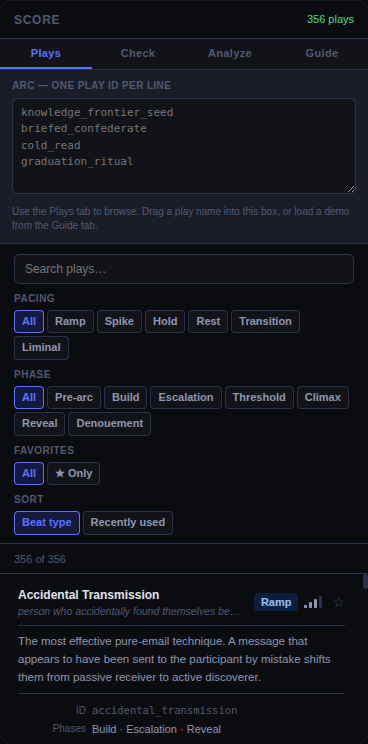
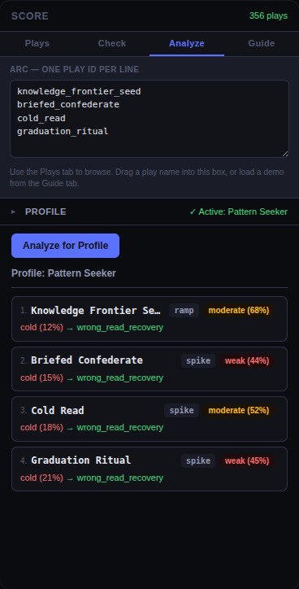

# ScoreImmersive

A design tool for immersive experience makers. Browse a library of 358 plays — atomic experience beats drawn from immersive theater, ARGs, pervasive games, and transformative experience design — arrange them into arcs, check them for structural problems, and score them against participant profiles.

Works as a **standalone web app** and as a **Miro sidebar panel** that reads your board and drops play cards directly onto it.

| Plays library | Engagement planner |
|---|---|
|  |  |

---

## Try it now

**[→ Open the app](https://justinstimatze.github.io/score/panel.html)** — no Miro account needed. Browse all 358 plays, build an arc in the text box, run the linter and planner right in your browser.

**[→ Browse the full plays library](plays.md)** — all 358 plays with complete metadata, readable on GitHub without opening the app.

---

## Add to Miro (3 steps, ~5 minutes)

1. Go to **[developers.miro.com](https://developers.miro.com/)** and sign in with your Miro account
2. Click **Create new app** → give it any name → under **App URL** paste exactly this:
   ```
   https://justinstimatze.github.io/score/panel.html
   ```
3. Under **Permissions** tick **boards:read** and **boards:write** → click **Install app and get OAuth token** → select your Miro team → **Add**

Open any board in that team. The ScoreImmersive icon appears in the left toolbar.

---

## What's in the library

358 plays across every domain that matters for immersive experience design:

- **Immersive theater** — mask mechanics, one-on-ones, environmental narrative, actor loops (Punchdrunk, Sleep No More)
- **ARGs and pervasive games** — real domains, planted evidence, breadcrumb trails, alternate reality layers (Jejune Institute, Ingress)
- **Transformative experience design** — micro-authorization cascades, counter-identity encounters, reintegration scaffolding (McLain)
- **Group dynamics** — faction formation, allegiance forks, shared crisis beats, group synchronization (Galactic Starcruiser)
- **Con artistry and intelligence tradecraft** — convincer mechanics, cold read, tradecraft patterns (Maurer, Goffman, FBI BCSM)
- **Ritual design** — graduation rituals, liminal transitions, threshold marking (van Gennep)
- **Physical world** — dead drops, spatial messages, location dispatch, certified mail
- **Digital and AI-native** — AI character interfaces, voice clones, synthetic media, LLM contamination

Each play has 27 fields: mechanisms, beat function, arc fit, somatic quality, identity invite, dwell time, detection window, reversibility, and more.

---

## Self-hosting (optional)

The steps above point at this repo's hosted copy. If you want to host your own — to use a private plays library or customise the app — the app is a folder of static files. Build it and put it anywhere.

**Netlify Drop** (no account required, 2 minutes)

1. Clone this repo, open a terminal in `miro-app/`, and run:
   ```sh
   npm install
   npm run build
   ```
2. Go to [app.netlify.com/drop](https://app.netlify.com/drop) and drag the `dist/` folder onto the page
3. Netlify gives you a URL — use that instead of the one above when registering in Miro

**GitHub Pages on your own fork**

Fork this repo, enable GitHub Pages under **Settings → Pages → GitHub Actions**, then add this workflow file:

<details>
<summary>.github/workflows/deploy.yml</summary>

```yaml
name: Deploy to GitHub Pages
on:
  push:
    branches: [main]
jobs:
  deploy:
    runs-on: ubuntu-latest
    permissions:
      pages: write
      id-token: write
    environment:
      name: github-pages
      url: ${{ steps.deployment.outputs.page_url }}
    steps:
      - uses: actions/checkout@v4
      - uses: actions/setup-node@v4
        with: { node-version: 20 }
      - run: cd miro-app && npm install && npm run build
      - uses: actions/upload-pages-artifact@v3
        with: { path: miro-app/dist }
      - uses: actions/deploy-pages@v4
        id: deployment
```
</details>

Your URL will be `https://your-username.github.io/score`. Use `/panel.html` appended when registering in Miro.

---

## How to use it

**Browse plays** — search by keyword, filter by phase (build, escalate, threshold, climax) or pacing (ramp, spike, hold). Expand any play to read its full description. In Miro, drag the ⠿ handle to drop a play card onto your board.

**Build an arc** — in Miro, arrange play cards left to right in sequence order. In the standalone app, type or paste play IDs into the arc input, one per line.

**Check Arc** — runs the structural linter against your sequence. Flags contraindicated pairs, missing permission grants, detection accumulation, rhythm problems, and more.

**Analyze for Profile** — load a participant profile (start from a template or build from scratch with Big Five sliders and mechanism weights), then run the planner to see engagement scores for each beat.

**Guide tab** — drop reference arcs onto your board: Sleep No More, House of the Latitude, The Game, Galactic Starcruiser, and others.

---

## For developers

The web app lives in [`miro-app/`](miro-app/). See [`miro-app/README.md`](miro-app/README.md) for the dev setup, project structure, and how to bring your own plays library.

The root of the repo contains the underlying Python toolchain — arc linter, planner, simulator, and the full plays library source (`plays.md`). These are the authoring tools used to build and maintain the library.

### Arc linter CLI

```sh
# Basic lint
python arc_linter.py play1 play2 play3 --days 0,3,7 --phases p,b,e

# From JSON arc file
python arc_linter.py -f arc.json

# Action-count detection window (for interactive narrative — counts plays, not calendar days)
python arc_linter.py -f arc.json --window-mode actions

# Possibility-space mode (enumerates all paths through alternatives, lints each)
python arc_linter.py -f arc.json --mode possibility
```

Arc JSON with alternatives:
```json
{
  "arc_type": "investigation",
  "plays": [
    {"id": "the_vetting_letter", "day": 0, "phase": "p"},
    {"id": "welcome_flood", "day": 3, "phase": "b", "alternatives": ["planted_object"]},
    {"id": "the_witness", "day": 7, "phase": "e"}
  ]
}
```

Checks: UNKNOWN, CONTRAINDICATED, FRAME_REQ, PERMISSION, LEAD_TIME, RHYTHM, DETECTION accumulation, REVERSIBILITY, ARC_FIT, LEGACY_SCOPE timing, REQUIRES consistency, MECHANISM_SATURATION, ALTERNATIVE_BEAT/PHASE/PERMISSION.

---

## License

**App code** (everything except the plays library) — [MIT](LICENSE)

**Plays library** (`plays.yaml`, `plays.md`, and derived JSON files) — [CC0 1.0](LICENSE-PLAYS) (public domain). No rights reserved.
